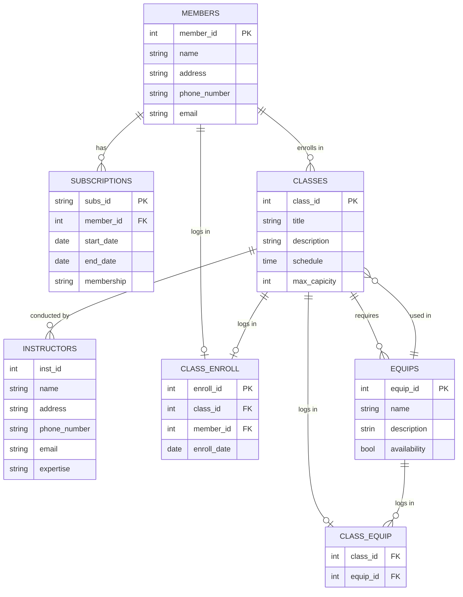

## **ERD For our GYM management system**

```mermaid
erDiagram

    MEMBERS {
        int member_id PK
        string name
        string address
        string phone_number
        string email
    }
    SUBSCRIPTIONS {
        string subs_id PK
        int member_id FK
        date start_date
        date end_date
        string membership
    }
    CLASSES {
        int class_id PK
        string title
        string description
        time schedule
        int max_capicity
    }
    INSTRUCTORS {
        int inst_id
        string name
        string address
        string phone_number
        string email
        string expertise
    }
    CLASS_ENROLL {
        int enroll_id PK
        int class_id FK
        int member_id FK
        date enroll_date
    }
    EQUIPS {
        int equip_id PK
        string name
        strin description
        bool availability
    }
    CLASS_EQUIP {
        int class_id FK
        int equip_id FK
    }
    MEMBERS ||--o{ SUBSCRIPTIONS : "has"
    MEMBERS ||--o{ CLASSES : "enrolls in"
    MEMBERS ||--o| CLASS_ENROLL : "logs in"
    CLASSES ||--o{ INSTRUCTORS : "conducted by"
    CLASSES ||--o{ EQUIPS : "requires"
    CLASSES ||--o| CLASS_ENROLL : "logs in"
    CLASSES ||--o| CLASS_EQUIP : "logs in"
    EQUIPS ||--o{ CLASSES : "used in"
    EQUIPS ||--o{ CLASS_EQUIP : "logs in"


```